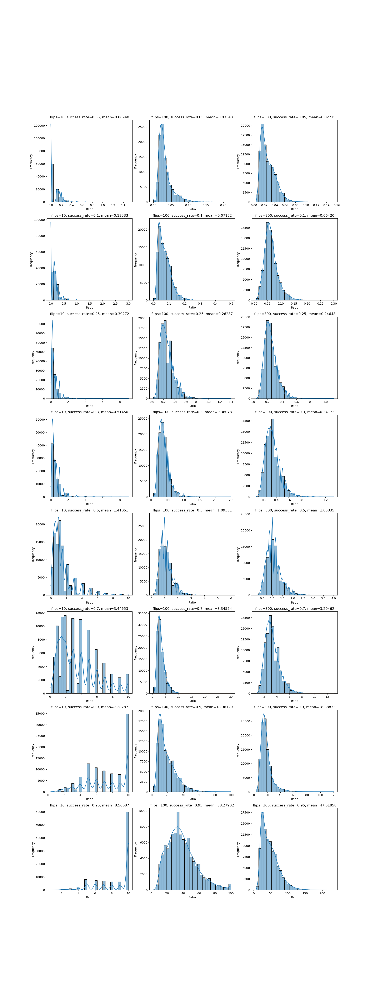

# Question

The OP [here](https://www.reddit.com/r/AskStatistics/comments/1e7gg2w/expected_ratio_of_longest_winning_and_losing/) asks essentially:

What is the expected ratio of the longest winning and losing streak given n games with win probability p?


# Answer

## Simulation

First things first, a simulation

If you use nix, run `nix develop` in this repo to get a shell with the necessary dependencies. If you don't, idk.


```console
python sim.py
```

will produce the `out.png` file in this directory (image at the bottom of this file).


The outputted graphs show the frequencies of the ratio for each n flips with success rate p for n in `{ 10 100 300 }` and p in `{ 0.05 0.1 0.25 0.3 0.5 0.7 0.9 0.95 }` with 100,000 trials for each parameter combination.


We can see that for 1000 flips (shots) with a success rate 0.3 (30% 3pt%), the mean of the ratios in our trials is centered at 0.33 with most trials being  between 0.25 and 0.45 ish.

But to answer OP's original question, from these simulations, we see that it was a coincidence that the expected ratio happens to be close to the win probability at p=0.3.

E.g. at p=0.1 (10% 3pt shooter), we can see that with 1,000 shots taken, the mean is centered at 0.06, or the expected ratio of the longest streak of makes is 6% of the longest streak of misses.


## Analytical

**Note:** I've realized this isn't correct (explained below), but will post it anyways. Maybe somebody smarter than me will see this some day and correct the flaw(s).

This can also be calculated exactly.

One of my favorite papers from my undergraduate days (linked below) covers how to compute the probability p, such that for n flips of a biased coin with probability q to land on heads, the longest run of heads is no greater than k.

We can use these cumulative probabilities to compute all possible combinations of the longest streak of heads/tails for a given number of flips and success probability, and find the exact expected value of the ratio.

One version is implemented in `longestrun.py`, another in C++ because the Python was quite slow (though I made it significantly faster so maybe its not so bad now).

```console
python longestrun.py
```

or

```console
g++ longestrun.cpp -o longestrun.o -lgmp -lgmpxx -O3
./longestrun.o
```

* As I type this I realize I've made a fatal mistake - the longest streaks aren't independent but I've treated them as such.
  - E.g. if we have 10 flips with p=0.9, the probability of getting 10 heads is 0.9^10, which obviously implies the only possible longest streak of tails is 0, but I've not treated it as such.
  - For small n with p near 0 or 1, this likely has a big impact, but for large n with p near 0.5, it may be negligible?
  - There are almost certainly other mistakes, but the simulation and wrong-by-some-amount analytical solution generally agree, so maybe it's not fully hopeless
  - A closer (but still wrong) approach might be to:
    - For each max streak of heads, assume that the streak happens with length h at the very beginning of the sequence, so that the max possible streak of tails isn't from the same n we used to calculate the probability of the longest run of heads, but (n - h). Use this probability for the max streak of losses when computing the expected value of the ratio.
    - This still wouldn't be fully correct though, surely, because the first assumption is false. If the streak of heads is in the very middle of the sequence, only 25% is left at the left or right end to have the max possible streak of tails
    - The final solution then, maybe, is for each max streak of heads h, iterate over all possible placements of the streak, and compute the probabilities for the longest streak of tails to the left and right of the sequence of heads? Then from there you can finally compute the expected value
      - I'm still not sure that's right. hmmmmmmmmmmmmmmmmmmmmmmmmmmm


The analytical solution, at least as I've done it, is super slow for large n, so I've only gone up to 200 flips in the cpp version.


| Flips | Success Rate  | Expected Ratio (~Analytical) | Expected Ratio (Simulation)
|-------|---------------|-----------------------------|----------------------------|
| 10    | 0.05          | 0.0529975                   | 0.06940
| 10    | 0.1           | 0.111947                    | 0.13533
| 10    | 0.25          | 0.349859                    | 0.39272
| 10    | 0.3           | 0.464229                    | 0.51450
| 10    | 0.5           | 1.27791                     | 1.41051
| 10    | 0.7           | 3.09471                     | 3.44653
| 10    | 0.9           | 4.57264                     | 7.28287
| 10    | 0.95          | 3.37039                     | 8.56687
| 100   | 0.05          | 0.0327249                   | 0.03348
| 100   | 0.1           | 0.0704872                   | 0.07192
| 100   | 0.25          | 0.261087                    | 0.26287
| 100   | 0.3           | 0.358988                    | 0.36078
| 100   | 0.5           | 1.08427                     | 1.09381 
| 100   | 0.7           | 3.31765                     | 3.34554
| 100   | 0.9           | 18.4681                     | 18.96129
| 100   | 0.95          | 37.5474                     | 38.27902
| 300   | 0.05          | 0.0268175                   | 0.02715
| 300   | 0.1           | 0.0638731                   | 0.06420
| 300   | 0.25          | 0.245927                    | 0.24648
| 300   | 0.3           | 0.340908                    | 0.34172
| 300   | 0.5           | 1.05469                     | 1.05835
| 300   | 0.7           | 3.28709                     | 3.29462
| 300   | 0.9           | 18.2787                     | 18.38833
| 300   | 0.95          | 46.9961                     | 47.61858


As expected, the analytical solution as I've done it is *most* wrong for small n, where there is the largest disagreement between the simulation and analytical results. As n increases they converge. The 100,000 simulation trials are certainly more accurate at n=10.

The analytical solution as implemented gives a nonsensical result of p=0.95 having a lower expected ratio than p=0.9. That's obviously wrong.


# References

[The Longest Run of Heads](https://www.tandfonline.com/doi/pdf/10.1080/07468342.1990.11973306)


# Graphs


